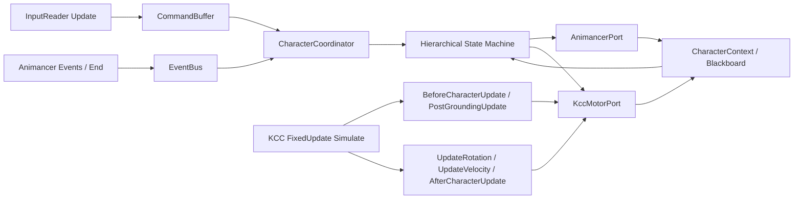
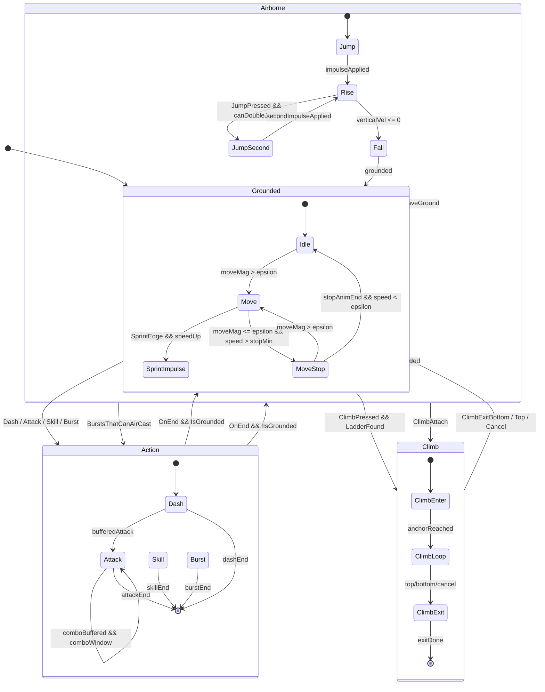

# Unity 类原神鸣潮 Demo 状态机架构研究报告

## 执行摘要

对你这个 **Unity 2022.3 LTS + Animancer v8 Pro + KCC + Generic Rig + Animation Rigging 脚步 IK** 的 demo 级项目，我最明确的建议是：**不要去找一个“完整照抄鸣潮/原神”的单一仓库直接跟做**，而是采用一套“官方基线组合”——**KCC 官方 Walkthrough 负责运动学接入与更新时序，Animancer 官方 FSM/3D Game Kit/Events/Animation Rigging 样例负责状态组织、打断规则、动画事件与 OnEnd、混合器和 IK 集成**；在此之上，用一个轻量的**代码优先层级状态机**来落地你的具体动作集。原因很直接：KCC 官方 Walkthrough 本来就把 **输入/相机** 与 **角色运动控制器** 拆开，Animancer 官方样例也明确把 **Character / State Machine / States / Brain** 拆成独立职责，且 Animancer 的 FSM 本身就是**不和动画系统强绑定**的；这两者正好天然适合做一个 `Context + 端口适配器 + HSM` 的结构。对你的动作集而言，最佳实践是：**连续世界状态用 KCC Tick 内轮询，离散主动技能用命令/事件驱动；基础移动由 KCC 驱动，短时强表现动作只“选择性”使用 Root Motion，并且把 Root Motion 转成 KCC 的速度/旋转输入，而不是直接推动 Transform；movestop 通过同步后的 locomotion cycle 相位、脚落地事件和 stop 动画元数据来选片与定起播百分比。** 这套方案最稳、最容易调、也最接近你要的“可直接实现”的工程形态。 citeturn23view0turn39search1turn39search2turn39search7turn29view4turn33view0turn9view0

## 架构设计

KCC 官方 Walkthrough 在教程一开始就明确把**输入与相机控制**放进 `MyPlayer`，把**运动与旋转求解**放进 `MyCharacterController`；Animancer 的 `06-01 Characters` 样例则把角色系统拆成 **Character / State Machine / States / Brain** 四层，`06-03 Brains` 进一步强调 Brain 只负责“想做什么”，State 才负责“实际能不能做、做了会怎样”。这和你要的 `Context` 解耦目标高度一致：**输入层只生成意图，状态机只做决策，KCC 只负责运动学求解，Animancer 只负责播放与回调，Context 负责把这些对象粘起来。** citeturn23view0turn39search1turn39search2turn39search7



基于你的动作范围，我推荐的不是“一个巨大单状态机”，而是**一个顶层协调器 + 一个主层级状态机**。顶层上只分三大类：**Locomotion、Airborne、Action/Traversal**。这样做的原因，是 Unity 官方对复杂动作拆成 Sub-State Machine 的建议本来就是“把复杂动作拆成多个阶段，否则图会迅速失控”；而你的 dash、climb、attack、skill、burst 都是典型的分阶段动作。 citeturn35view1turn35view2



**切换规则**建议这样定：

- **Grounded 系**：`Idle / Move / SprintImpulse / MoveStop` 是 grounded 子状态；任何时刻检测到离地就立刻离开该子机，进入 `Airborne`。  
- **Airborne 系**：`Jump / JumpSecond` 是短暂启动态，它们只负责施加一次冲量和起跳动画，之后快速落到 `Rise / Fall` 这两个稳定态。  
- **Action 系**：`Dash / Attack / Skill / Burst` 一律视为高优先级主动状态，不建议挂在 Animator Controller 的 transition graph 里做图形化条件，而是在代码里由 `TryEnter` / `CanExit` 明确裁决。Animancer 的官方样例本来就采用这种“脚本决定逻辑”的方式。 citeturn39search3turn17view1turn17view0
- **Climb 系**：参考 KCC Walkthrough 的梯子实现，把 `ClimbEnter / ClimbLoop / ClimbExit` 当成一个 traversal 子状态机，进入时可关闭部分碰撞/解算，贴近/脱离梯子时使用明确的速度与旋转插值，不让外部状态直接篡改它。 citeturn33view0

我不推荐把 **Animator Controller** 再当作**主逻辑状态机**。Unity 官方 Animator 状态机当然能做状态、过渡、子状态机，但 Animancer 官方文档明确说明：**Animancer 没有等价的 Animator Parameters 与 StateMachineBehaviour 驱动方式，因为逻辑应该由脚本负责**；对你这种 KCC 条件、输入缓冲、主动技能响应为主的角色系统，**代码优先的状态对象模式**比图形化状态图更稳、更可测、更好 debug。 citeturn13view4turn16search17turn39search7

## 事件契约与切换规则

**“全事件驱动”**和**“全轮询”**都不是你的最优解。UnityHFSM 的文档把 transition 分成 **polling-based transitions** 和 **trigger transitions** 两类，这个分类非常适合你的项目：**离散的玩家意图**（Jump、Dash、Attack、E、Q、ClimbTry）用 trigger/command；**连续世界状态**（是否落地、垂直速度、当前 move 相位、坡度、输入幅度）用每 Tick 轮询。KCC 的运动更新本来就是在固定时序里分两阶段执行，因此 grounded/velocity/slope 这类信号天然更适合在 KCC Tick 中轮询；但主动输入若全靠 FixedUpdate 轮询又容易出现 Update 与 FixedUpdate 之间的丢触发，所以必须加命令缓冲。 citeturn12view1turn29view4turn28view0

我的推荐是：

- **命令流同步、主线程、同帧可消费**。不要用 Task/async 去驱动状态切换，Unity API、Animancer、KCC 都是主线程语义。  
- **命令带优先级、过期时间、频道、可取消语义**。  
- **状态切换只发生在协调器和 KCC 回调的受控位置**，不要让任意脚本直接 `Play()` 动画然后顺手改状态。  
- **Animancer 事件负责“时机通知”，而不是“最终决策”**。事件只发消息给状态机，是否切换仍由状态机根据当前上下文决定。  
- **OnEnd 只用于自然收尾**，被打断后的清理交给 `Exit()`，不要依赖 ExitEvent；Animancer 官方文档也明确更推荐用 FSM 处理打断，而不是依赖 ExitEvent。 citeturn14search14turn16search11turn17view1

下表是适合这个 demo 的**推荐事件契约**。表里很多项是工程建议，不是插件“必须如此”，但它们与 KCC/Animancer/UnityHFSM 的能力边界是吻合的。 citeturn12view1turn28view0turn15view3turn15view4

| 事件或命令 | 发布方 | 消费方 | 同步性 | 缓冲建议 | 优先级 | 可取消 | 用途 |
|---|---|---|---|---|---|---|---|
| `CmdJumpPressed` | InputReader | Coordinator / AirborneSM | 同步 | 0.10s | 高于平A，低于大招 | 是 | 起跳、二段跳 |
| `CmdDashPressed` | InputReader | Coordinator / ActionSM | 同步 | 0.08s | 高 | 是 | 冲刺中断、位移技能 |
| `CmdAttackPressed` | InputReader | Coordinator / ActionSM | 同步 | 0.20s | 中 | 是 | 平A起手与连段缓存 |
| `CmdSkillPressed` | InputReader | Coordinator / ActionSM | 同步 | 0.15s | 很高 | 是 | E 技能 |
| `CmdBurstPressed` | InputReader | Coordinator / ActionSM | 同步 | 0.15s | 最高 | 视设计 | Q 大招 |
| `CmdClimbPressed` | InputReader | Coordinator / TraversalSM | 同步 | 0.15s | 高 | 是 | 检测并吸附梯子/攀爬点 |
| `EvtGroundedChanged` | KCC | Coordinator / LocomotionSM | 同步 | 不缓冲 | 系统 | 否 | 离地、落地判定 |
| `EvtLanded` | KCC | Coordinator / LocomotionSM | 同步 | 不缓冲 | 系统 | 否 | 从 Airborne 回 Grounded |
| `EvtAnimEvent_FootL/R` | Animancer | IK / Footstep / MoveStopTracker | 同步 | 不缓冲 | 低 | 否 | 脚步、脚相位跟踪 |
| `EvtAnimEvent_HitOpen/Close` | Animancer | CombatSystem | 同步 | 不缓冲 | 高 | 否 | 攻击判定窗 |
| `EvtAnimEnd` | Animancer | CurrentState | 同步 | 不缓冲 | 系统 | 否 | 自然回收、自动回 Idle/Move |
| `EvtMoveStopCandidate` | LocomotionSM | MoveStopSelector | 同步 | 不缓冲 | 中 | 否 | 选择 stopWalkL/stopRunR 等 |

实现上，建议把命令缓冲做成**固定容量 ring buffer + 每频道单槽覆盖**。例如 `Locomotion`、`Action`、`Traversal` 三个频道：Jump 和 Dash 不要互相覆盖，Attack/Skill/Burst 共享 `Action` 频道，新的高优先级命令可挤掉低优先级命令。这样既能避免杂乱队列，也容易在调试面板里直观看到。这个做法和 Animancer Interruptions 样例里用 `Priority/CanExitState` 显式管理“谁能打断谁”的思路是一致的。 citeturn17view1turn17view0

## 动画与运动同步实现

KCC 的核心价值不是“帮你播动画”，而是**把位移、旋转、贴地、斜坡、附着刚体、碰撞解算的时序做对**。公开的 KCC `ICharacterController` 接口和示例代码显示，运动控制器会在合适时机调用 `BeforeCharacterUpdate`、`PostGroundingUpdate`、`UpdateRotation`、`UpdateVelocity`、`AfterCharacterUpdate` 等钩子；系统层则在 `FixedUpdate` 里先更新 mover，再跑角色 `UpdatePhase1`，再位移 mover，最后角色 `UpdatePhase2`。所以真正稳定的做法，不是让状态机在外面随意改 Transform，而是让**当前叶状态在 KCC 回调中输出“这一 Tick 的目标速度/旋转/附加解算策略”**。 citeturn28view0turn29view4turn30view1turn32view1

这会直接导出一个非常重要的结论：**基础 locomotion、jump、fall、climb 都应以 KCC 驱动为主；Root Motion 只用于短时、节奏明确、艺术要求高的动作段。** KCC Walkthrough 的 Root Motion 示例明确指出：应该在 `OnAnimatorMove` 里**累计**每帧 Root Motion delta，等到角色更新时把它**转成速度**并在 `UpdateVelocity` / `UpdateRotation` 中应用；如果直接让动画推动 Transform，角色的碰撞与运动解算就不会被纳入。Animancer 也明确区分了 Root Motion 的利弊：它更自然，但精确控制更差；在需要更强响应性的场景下，可以只保留沿玩家目标方向的 Root Motion 分量。 citeturn33view0turn8search18turn13view5turn13view1

对你的 demo，我建议这样拆：

- **KCC 驱动**：`idle/walk/run/sprint/jump/jumpSecond/rise/fall/climb`。  
- **可选 Root Motion**：`dash/sprintImpulse/movestop/平A起手/技能前摇或后摇/大招关键段`。  
- **混合方案**：在 Dash、Skill、Burst、Stop 中读 `OnAnimatorMove`，但最终仍回写到 KCC 的 velocity/rotation；在 Locomotion 中默认关闭 `Apply Root Motion`，只保留姿态动画。官方 KCC 和 Animancer 文档都支持这种模式。 citeturn13view6turn33view0turn13view5

**Animancer 参数方案**上，我不建议把它当成 Mecanim 式“全参数驱动控制器”。Animancer 官方文档明确说：**Animancer 没有直接等价于 Animator Parameters 的动画选择机制，真正的选择逻辑应该写在脚本里**；但它又提供了一个**强类型、可监听的参数字典**，可让 Mixer/Controller State 把内部参数映射到一个中心字典，供其他脚本读写和观察。对你的项目，最合理的是**混合方案**：

- **动画选择**：用 `AnimationId enum + ScriptableObject 数据表`。  
- **平滑/连续混合值**：用 `Animancer.Parameters`，例如 `MoveSpeed`、`MoveXY`、`SlopeBlend`、`IKWeightL`、`IKWeightR`。  
- **调试与热更新**：把动作元数据放在 `ActionDefinitionSO`、`MovementSetSO`、`MoveStopSetSO`。  

这样既能避免满地散落的硬编码 Clip 引用，也不会退回 Animator Controller 的参数泥潭。Animancer 的 Mixers 可以直接在 Inspector 做 `Transition Asset`，也可以用代码手工构建；对你的最小可用 demo，**一个不同步 Idle、同步 Walk/Run/Sprint 的 Linear Mixer** 就已经很好用。如果以后补齐前后左右四向动作，再把它换成 2D Directional Mixer。 citeturn13view4turn15view0turn15view1turn15view2turn38view0turn39search12turn39search4

**Animation Rigging** 对你这个 Generic 模型是合适的。Animancer 的 Animation Rigging 集成页明确指出：Unity 的 Animation Rigging 包支持像 Multi-Parent Constraint、IK 这类程序化修改，并且 **IK 可用于 Generic 与 Humanoid**；Animancer 也给出 Uneven Ground 样例，演示如何根据地形高度、动画曲线读值去控制脚部 IK。对你的场景，建议把脚 IK 做成**Rig 后处理层**，不要让它成为主状态切换条件；状态机只输出 `IsGrounded、GroundNormal、FootIKWeight` 和脚部目标点数据，Rig 负责最终修正。另一个很重要的官方注意点是：若用 Animation Rigging，**IK 的 Target/Hint 对象不要放在 Animator 节点下面**，否则在某些重建图结构时会被重置。 citeturn37view0turn37view1turn39search6

**Animancer 事件和 OnEnd** 的推荐用法也很明确：  
Animancer Events 适合打脚步、判定窗、特效窗这类“经过某个时间点就发一次”的事件；中央事件字典还能让你按事件名统一绑定回调，脚步和落脚点跟踪特别方便。End Event 则适合做“播完回 Idle/Move”这类自然收尾，但要记住它在到达结束点后会**每帧触发**，直到你切到别的状态或者停止，所以它的回调最好立刻触发状态切换，而不是留一堆副作用逻辑。 citeturn15view3turn15view4turn14search14

**movestop 的关键不是“停下后播哪个 clip”，而是“停下的那一刻当前运动循环在哪个相位”。** Animancer 的 Mixer Synchronization 文档强调：如果 Walk/Run 不同步，就会出现左右脚对不齐的奇怪混合；而同步后，Walk/Run 会保持在等价 pose 的同一 `NormalizedTime`。这正是做 movestop 的基础：**先保证 locomotion cycle 同步，再用 cycle phase 去选 stop clip，并把 stop clip 从合适的对齐点起播。** citeturn38view0turn38view1

我建议你给每个 stop 动画配置如下元数据：

- `Gait`：Walk / Run / Sprint  
- `LeadFoot`：Left / Right  
- `SourcePhase`：这个 stop 最适合衔接到 locomotion cycle 的哪个相位  
- `AlignNormalized`：stop clip 内哪个相位与 locomotion 的对齐 pose 对应  
- `StartClamp`：允许的起播百分比范围，例如 `0.0 ~ 0.35`

然后按下面的流程选片：

1. 读取当前 gait 与当前 locomotion `t = normalizedTime % 1`。  
2. 优先用**脚步事件记录的最近落脚脚**确定 `LeadFoot`；没有时再用简化规则（例如对称双步循环里 `t < 0.5` 视作左脚主导）。Animancer 的中央事件字典正适合绑定这种脚步名事件。 citeturn15view3turn15view4
3. 在同 gait、同 lead foot 的 stop 候选里，找 `SourcePhase` 与 `t` 的**最短环形相位差**最小者。  
4. 用 `clipStart = AlignNormalized + phaseDelta` 得到 stop clip 起播百分比，再按 `StartClamp` 约束。  
5. 若 stop clip 带 Root Motion，照样把它转为 KCC velocity，不直接推 Transform。 citeturn33view0turn13view5

这个方案比“if t < 0.5 播 stopWalkL 否则 stopWalkR”更稳，因为它允许你后续替换成不完全对称的 stop 动画，而不必重写系统。

## 关键接口与代码草图

下面这张表给出一套**足够直接落地**的最小核心对象。它有意不做过度抽象，但 Context、KCC、Animancer、状态机之间的边界是清晰的。

| 类型 | 角色 | 关键内容 | 备注 |
|---|---|---|---|
| `CharacterContext` | 全局上下文 | `MotorPort`、`AnimPort`、`Bus`、`Commands`、`Blackboard`、`Defs` | 所有状态共享 |
| `CharacterBlackboard` | 运行时只读/只写数据 | grounded、verticalVel、moveInput、facing、lastFootPlant、jumpCount | 统一状态数据流 |
| `CharacterCoordinator` | 顶层协调器 | Update 收输入、消费命令、驱动主状态机 | 唯一入口 |
| `CharacterStateBase` | 状态基类 | `Enter/Exit/Tick/...` + KCC 钩子 | 纯 C# |
| `HierarchicalStateMachine` | 层级状态机 | `TryChange/ForceChange/CurrentLeaf` | 管规则与打断 |
| `KccMotorPort` | KCC 适配器 | `IsGrounded`、`ForceUnground`、`GetVelocityForMovePosition` | 对状态隐藏具体插件 |
| `AnimancerPort` | Animancer 适配器 | `Play`、`PlayAtNormalized`、`BindEnd`、`BindNamedEvent`、`SetParameter` | 对状态隐藏动画图细节 |
| `CommandBuffer` | 输入缓冲 | 优先级、频道、TTL、覆盖策略 | 解 Update/FixedUpdate 丢触发 |
| `ActionDefinitionSO` | 数据驱动定义 | 动画、RootMotionPolicy、优先级、事件名、窗口 | Dash/平A/E/Q 可共用 |
| `MoveStopSetSO` | 停身元数据 | gait、leadFoot、sourcePhase、alignNormalized | 专门处理 movestop |

下面的代码片段不是完整成品，但已经足够作为实现骨架。

```csharp
using System;
using System.Collections.Generic;
using UnityEngine;

public enum CharacterStateId
{
    Idle, Move, SprintImpulse, MoveStop,
    Jump, JumpSecond, Rise, Fall,
    ClimbEnter, ClimbLoop, ClimbExit,
    Dash, Attack, Skill, Burst,
}

public enum StatePriority
{
    Locomotion = 0,
    Airborne = 10,
    Attack = 20,
    Dash = 30,
    Skill = 40,
    Burst = 50,
    Traversal = 60,
}

public sealed class CharacterContext
{
    public readonly IKccMotorPort Motor;
    public readonly IAnimancerPort Anim;
    public readonly ICharacterEventBus Bus;
    public readonly CharacterCommandBuffer Commands;
    public readonly CharacterBlackboard Bb;
    public readonly CharacterDefinitions Defs;

    public float FrameDeltaTime;
    public float TickDeltaTime;

    public CharacterContext(
        IKccMotorPort motor,
        IAnimancerPort anim,
        ICharacterEventBus bus,
        CharacterCommandBuffer commands,
        CharacterBlackboard bb,
        CharacterDefinitions defs)
    {
        Motor = motor;
        Anim = anim;
        Bus = bus;
        Commands = commands;
        Bb = bb;
        Defs = defs;
    }
}

public sealed class CharacterBlackboard
{
    public bool IsGrounded;
    public Vector3 GroundNormal = Vector3.up;
    public float VerticalSpeed;
    public Vector2 MoveInput;
    public Vector3 DesiredWorldMove;
    public Vector3 Facing = Vector3.forward;
    public int JumpCount;
    public FootPhase LastFootPlant = FootPhase.Unknown;
    public float LocomotionPhase01;
    public bool WantsSprint;
}
```

```csharp
public interface IKccMotorPort
{
    bool IsGrounded { get; }
    Vector3 GroundNormal { get; }
    Vector3 CharacterUp { get; }
    Vector3 Velocity { get; }

    void ForceUnground(float duration = 0.1f);
    void SetCollisionSolving(bool active);
    void SetGroundingSolving(bool active);

    Vector3 GetVelocityForMovePosition(Vector3 targetPosition, float deltaTime);
}

public interface IAnimancerPort
{
    AnimancerStateHandle Play(AnimationId id, float fade = 0.08f);
    AnimancerStateHandle PlayAtNormalized(AnimationId id, float normalizedTime, float fade = 0.05f);
    void BindEnd(AnimancerStateHandle handle, Action callback);
    void BindNamedEvent(string eventName, Action callback);
    void SetFloat(string name, float value);
    float GetCurrentNormalizedTime();
}

public readonly struct AnimancerStateHandle
{
    public readonly object Raw; // 实际项目里换成 AnimancerState。
    public AnimancerStateHandle(object raw) => Raw = raw;
}
```

```csharp
public interface ICharacterState
{
    CharacterStateId Id { get; }
    StatePriority Priority { get; }

    bool CanEnter(in StateChangeRequest request);
    bool CanExit(in StateChangeRequest request);

    void Enter(in StateChangeRequest request);
    void Exit(in StateChangeRequest request);

    void Tick(float deltaTime);

    // KCC 钩子
    void BeforeCharacterUpdate(float deltaTime);
    void PostGroundingUpdate(float deltaTime);
    void UpdateRotation(ref Quaternion currentRotation, float deltaTime);
    void UpdateVelocity(ref Vector3 currentVelocity, float deltaTime);
    void AfterCharacterUpdate(float deltaTime);
}

public readonly struct StateChangeRequest
{
    public readonly CharacterStateId From;
    public readonly CharacterStateId To;
    public readonly StatePriority Priority;
    public readonly string Reason;

    public StateChangeRequest(CharacterStateId from, CharacterStateId to, StatePriority priority, string reason)
    {
        From = from;
        To = to;
        Priority = priority;
        Reason = reason;
    }
}
```

```csharp
public abstract class CharacterStateBase : ICharacterState
{
    protected readonly CharacterContext Ctx;

    protected CharacterStateBase(CharacterContext ctx)
    {
        Ctx = ctx;
    }

    public abstract CharacterStateId Id { get; }
    public abstract StatePriority Priority { get; }

    public virtual bool CanEnter(in StateChangeRequest request) => true;
    public virtual bool CanExit(in StateChangeRequest request) => request.Priority >= Priority;

    public virtual void Enter(in StateChangeRequest request) { }
    public virtual void Exit(in StateChangeRequest request) { }
    public virtual void Tick(float deltaTime) { }

    public virtual void BeforeCharacterUpdate(float deltaTime) { }
    public virtual void PostGroundingUpdate(float deltaTime) { }
    public virtual void UpdateRotation(ref Quaternion currentRotation, float deltaTime) { }
    public virtual void UpdateVelocity(ref Vector3 currentVelocity, float deltaTime) { }
    public virtual void AfterCharacterUpdate(float deltaTime) { }
}
```

```csharp
public enum CommandChannel { Locomotion, Action, Traversal }
public enum CharacterCommandType { Jump, Dash, Attack, Skill, Burst, Climb }

public readonly struct CharacterCommand
{
    public readonly CharacterCommandType Type;
    public readonly CommandChannel Channel;
    public readonly int Priority;
    public readonly float ExpiresAt;
    public readonly string Reason;

    public CharacterCommand(CharacterCommandType type, CommandChannel channel, int priority, float expiresAt, string reason)
    {
        Type = type;
        Channel = channel;
        Priority = priority;
        ExpiresAt = expiresAt;
        Reason = reason;
    }
}

public sealed class CharacterCommandBuffer
{
    private readonly Dictionary<CommandChannel, CharacterCommand> _slots = new();

    public void Push(CharacterCommand command, float now)
    {
        if (command.ExpiresAt <= now) return;

        if (_slots.TryGetValue(command.Channel, out var old))
        {
            // 高优先级覆盖；同优先级后到覆盖先到。
            if (old.Priority > command.Priority) return;
        }

        _slots[command.Channel] = command;
    }

    public bool TryConsume(CommandChannel channel, float now, out CharacterCommand command)
    {
        if (_slots.TryGetValue(channel, out command) && command.ExpiresAt > now)
        {
            _slots.Remove(channel);
            return true;
        }

        command = default;
        _slots.Remove(channel);
        return false;
    }
}
```

下面是 **KCC 适配器**。重点是：**所有真正会影响运动学的状态逻辑，都通过 KCC 的回调来执行**，而不是在 Update 里乱改 Transform。这个模式直接对应 KCC 的公开接口设计。 citeturn28view0turn29view4turn32view1

```csharp
using KinematicCharacterController;
using UnityEngine;

public sealed class KccCharacterAdapter : MonoBehaviour, ICharacterController
{
    [SerializeField] private KinematicCharacterMotor _motor;
    public CharacterCoordinator Coordinator;

    private void Awake()
    {
        _motor.CharacterController = this;
    }

    public void BeforeCharacterUpdate(float deltaTime)
        => Coordinator.CurrentState.BeforeCharacterUpdate(deltaTime);

    public void PostGroundingUpdate(float deltaTime)
        => Coordinator.CurrentState.PostGroundingUpdate(deltaTime);

    public void UpdateRotation(ref Quaternion currentRotation, float deltaTime)
        => Coordinator.CurrentState.UpdateRotation(ref currentRotation, deltaTime);

    public void UpdateVelocity(ref Vector3 currentVelocity, float deltaTime)
        => Coordinator.CurrentState.UpdateVelocity(ref currentVelocity, deltaTime);

    public void AfterCharacterUpdate(float deltaTime)
        => Coordinator.CurrentState.AfterCharacterUpdate(deltaTime);

    public bool IsColliderValidForCollisions(Collider coll) => true;
    public void OnGroundHit(Collider hitCollider, Vector3 hitNormal, Vector3 hitPoint, ref HitStabilityReport hitStabilityReport) { }
    public void OnMovementHit(Collider hitCollider, Vector3 hitNormal, Vector3 hitPoint, ref HitStabilityReport hitStabilityReport) { }
    public void ProcessHitStabilityReport(Collider hitCollider, Vector3 hitNormal, Vector3 hitPoint, Vector3 atCharacterPosition, Quaternion atCharacterRotation, ref HitStabilityReport hitStabilityReport) { }
    public void OnDiscreteCollisionDetected(Collider hitCollider) { }
}
```

下面是一个**Dash 状态**示例。它展示了三件事：  
**主动命令高响应进入**、**用 Animancer 播放动作并绑定 OnEnd**、**真正的位移由 KCC velocity 回调给出**。

```csharp
public sealed class DashState : CharacterStateBase
{
    private readonly float _dashSpeed;
    private readonly float _dashDuration;
    private Vector3 _dashDirection;
    private float _remain;

    public DashState(CharacterContext ctx, float dashSpeed, float dashDuration) : base(ctx)
    {
        _dashSpeed = dashSpeed;
        _dashDuration = dashDuration;
    }

    public override CharacterStateId Id => CharacterStateId.Dash;
    public override StatePriority Priority => StatePriority.Dash;

    public override void Enter(in StateChangeRequest request)
    {
        _dashDirection = Ctx.Bb.DesiredWorldMove.sqrMagnitude > 0.0001f
            ? Ctx.Bb.DesiredWorldMove.normalized
            : Ctx.Bb.Facing;

        _remain = _dashDuration;

        // 让角色脱离贴地吸附，避免“地吸住”冲刺。
        Ctx.Motor.ForceUnground(0.1f);

        var handle = Ctx.Anim.Play(AnimationId.Dash, 0.04f);
        Ctx.Anim.BindEnd(handle, () =>
        {
            // OnEnd 只做“请求切回机动状态”的收尾，不在这里写复杂逻辑。
            // 实际项目里可发事件给 Coordinator，由它判回 Grounded 还是 Airborne。
        });
    }

    public override void UpdateVelocity(ref Vector3 currentVelocity, float deltaTime)
    {
        currentVelocity = _dashDirection * _dashSpeed;
        _remain -= deltaTime;
    }

    public override void AfterCharacterUpdate(float deltaTime)
    {
        if (_remain <= 0f)
        {
            // 请求退出。省略具体 Coordinator 调用。
        }
    }

    public override bool CanExit(in StateChangeRequest request)
    {
        // 只允许更高优先级动作打断，或自然结束退出。
        return _remain <= 0f || request.Priority > Priority;
    }
}
```

下面是 **Animancer Root Motion 收集器**。它遵循 KCC Walkthrough 推荐的模式：**在 `OnAnimatorMove` 里累计，在 KCC Tick 内消费**。如果是 grounded，可以先投影到地面法线平面；如果是强响应 dash/attack，也可以只取期望朝向上的分量。 citeturn33view0turn13view1turn8search18

```csharp
using UnityEngine;

public sealed class RootMotionAccumulator : MonoBehaviour
{
    [SerializeField] private Animator _animator;

    public Vector3 DeltaPosition { get; private set; }
    public Quaternion DeltaRotation { get; private set; } = Quaternion.identity;

    private void OnAnimatorMove()
    {
        DeltaPosition += _animator.deltaPosition;
        DeltaRotation = _animator.deltaRotation * DeltaRotation;
    }

    public void ConsumeToKcc(
        bool grounded,
        Vector3 groundNormal,
        float deltaTime,
        ref Vector3 currentVelocity,
        ref Quaternion currentRotation)
    {
        if (deltaTime <= 0f) return;

        var motion = DeltaPosition;
        if (grounded)
            motion = Vector3.ProjectOnPlane(motion, groundNormal);

        currentVelocity = motion / deltaTime;
        currentRotation = DeltaRotation * currentRotation;

        DeltaPosition = Vector3.zero;
        DeltaRotation = Quaternion.identity;
    }
}
```

最后是最关键的 **movestop 选择器**。这是我最建议你直接照着落地的一段骨架。

```csharp
using System;
using System.Collections.Generic;
using UnityEngine;

public enum Gait { Walk, Run, Sprint }
public enum FootPhase { Unknown, Left, Right }

[Serializable]
public sealed class MoveStopEntry
{
    public AnimationId AnimationId;
    public Gait Gait;
    public FootPhase LeadFoot;

    [Range(0, 1)] public float SourcePhase;       // 适配的 locomotion 相位
    [Range(0, 1)] public float AlignNormalized;   // stop 动画中与 SourcePhase 对齐的时间点
    public Vector2 StartClamp = new(0f, 0.35f);   // 推荐起播范围
}

public readonly struct MoveStopSelection
{
    public readonly AnimationId AnimationId;
    public readonly float StartNormalizedTime;

    public MoveStopSelection(AnimationId animationId, float startNormalizedTime)
    {
        AnimationId = animationId;
        StartNormalizedTime = startNormalizedTime;
    }
}

public static class MoveStopSelector
{
    public static MoveStopSelection Select(
        IReadOnlyList<MoveStopEntry> entries,
        Gait gait,
        float locomotionPhase01,
        FootPhase lastFootPlant)
    {
        MoveStopEntry best = null;
        float bestAbsDelta = float.MaxValue;
        float bestDelta = 0f;

        for (int i = 0; i < entries.Count; i++)
        {
            var e = entries[i];
            if (e.Gait != gait) continue;
            if (lastFootPlant != FootPhase.Unknown && e.LeadFoot != lastFootPlant) continue;

            float delta = ShortestPhaseDelta(e.SourcePhase, locomotionPhase01);
            float absDelta = Mathf.Abs(delta);

            if (absDelta < bestAbsDelta)
            {
                best = e;
                bestAbsDelta = absDelta;
                bestDelta = delta;
            }
        }

        if (best == null)
            throw new InvalidOperationException($"No MoveStopEntry found for gait={gait}, foot={lastFootPlant}");

        float start = Mathf.Repeat(best.AlignNormalized + bestDelta, 1f);
        start = ClampWrapped(start, best.StartClamp.x, best.StartClamp.y);

        return new MoveStopSelection(best.AnimationId, start);
    }

    // 环形归一化时间差，结果在 [-0.5, 0.5)
    public static float ShortestPhaseDelta(float from, float to)
    {
        return Mathf.Repeat(to - from + 0.5f, 1f) - 0.5f;
    }

    private static float ClampWrapped(float t, float min, float max)
    {
        // demo 版够用了：不做区间跨 1 的版本，要求元数据把范围设成普通区间。
        return Mathf.Clamp(t, min, max);
    }
}
```

你的 `MoveStopState.Enter()` 大概只需这样：

```csharp
public override void Enter(in StateChangeRequest request)
{
    var gait = ResolveCurrentGait(); // Walk/Run/Sprint
    float phase = Ctx.Bb.LocomotionPhase01;
    var selection = MoveStopSelector.Select(
        Ctx.Defs.MoveStops.Entries,
        gait,
        phase,
        Ctx.Bb.LastFootPlant);

    Ctx.Anim.PlayAtNormalized(selection.AnimationId, selection.StartNormalizedTime, 0.03f);
}
```

这套写法最大的好处是：**以后你补 StopRunLHeavy / StopRunRSoft / SprintBrake 等 stop 变体时，不需要改状态机，只加数据。**

## 相机、调试与测试

### 相机建议

KCC Walkthrough 自带的 `ExampleCharacterCamera` 本质上是**教学用示例相机**：教程只要求你把它挂进 `MyPlayer`，绑定 orbit point，然后把相机输入转交给它，文档也明确说“相机处理不是本教程重点，看代码注释即可”。这说明它非常适合快速原型，但并不是一个以镜头语言、碰撞、混合、模式切换为目标的完整相机框架。相比之下，Cinemachine 官方文档提供的是一整套 **target tracking、composition、blend、collision resolution、target group、events、第三人称瞄准扩展**。对类原神/鸣潮 demo 来说，这些能力更贴近真实需求。 citeturn23view0turn19view0turn22view2turn22view1turn22view3

| 方案 | 优点 | 缺点 | 结论 |
|---|---|---|---|
| KCC `ExampleCharacterCamera` | 与 KCC 示例直接对齐；接线最少；足够做原型 | 功能更偏示例；镜头碰撞、模式切换、混合、镜头事件能力弱 | 适合先跑通样机 |
| Cinemachine Third Person Follow | 自带第三人称跟随、目标与肩位控制、内置相机碰撞、可扩展瞄准、镜头混合和事件体系 | 需要单独配置 CameraTarget 和输入桥接 | **更推荐用于你的 demo** |

我对你的项目的实际建议是：**直接用 Cinemachine**。  
集成要点如下：

- 在角色上挂一个 `CameraTarget` 空物体，专门承接 yaw/pitch。  
- 玩家输入先旋转 `CameraTarget`，角色 body 只在“有移动输入、瞄准、锁定镜头”时跟 yaw。  
- 用 `Third Person Follow` 跟随 `CameraTarget`，用 `Ignore Tag` 忽略角色本体。  
- dash / skill / burst 时，通过 Cinemachine 的 camera events、impulse、或局部参数修改做轻镜头强化。  
- 如果你很在意 FixedUpdate 插值造成的“角色朝向看起来比镜头慢半拍”，可以借鉴 KCC Walkthrough 的 **Frame Perfect Rotation** 思路：物理根旋转仍在 FixedUpdate，视觉 MeshRoot 在 Update 里额外跟到最新输入。 citeturn22view0turn22view1turn22view3turn23view5

### 调试与测试建议

Animancer 官方文档对调试给了两个非常实用的方向：**Live Inspector** 和 **参数交互日志**。Live Inspector 能直接在 Play Mode 中看当前状态、权重、时间、速度；参数还支持右键 `Log Interactions`；如果装了 Unity 的 **Playable Graph Visualizer**，Animancer 还能直接把当前图送去可视化。对你这种“状态切换 + mixer + 事件 + IK”的系统，这些工具的价值非常高。 citeturn34search0turn34search2turn34search3turn34search5

我建议你把调试分成三层：

- **日志层**：每次 `TryEnter/Reject/Exit` 都记一条结构化日志，附 `from -> to / reason / current phase / grounded / queued commands`。  
- **可视化层**：在 Scene 里画 `GroundNormal`、`DesiredMove`、`DashDir`、`ClimbAnchor`、左右脚 IK target；在屏幕上做一个简易状态叠板。  
- **动画层**：用 Animancer Live Inspector 看 mixer 子状态时间同步、End Event 是否按预期回收、参数是否被多个系统抢写。  

测试则建议分成：

- **纯单元测试**：`MoveStopSelector.ShortestPhaseDelta`、命令优先级覆盖、TTL 失效、`CanExit/CanEnter` 规则。  
- **PlayMode 测试**：Jump→Rise→Fall→Grounded；平A连段缓冲；Dash 期间按 Jump/Attack 的裁决；Climb 吸附与脱离；落地时 MoveStop 是否正确。  
- **回归场景**：斜坡、小台阶、平台边缘、移动平台、梯子顶端、连续 spam Dash/Attack/E/Q。  

性能上，这套结构的优势是很明显的：**每 Tick 只更新当前活跃叶状态与少量命令槽**，复杂度主要和“活跃状态数、命令频道数、动画图当前节点数”相关，而不是和你总共定义了多少状态线性耦合。真正要避免的是 GC 和状态所有权混乱：缓存参数、缓存状态实例、缓存动画句柄，不要在每次 Enter 都 new 一堆临时对象；共享 Transition 时，尽量把回调绑定到 state instance，而不是到共享资产本身，Animancer v8 的事件共享重构正是为了解决这类 ownership 问题。 citeturn39search11turn15view0

## 参考实现选择与最终推荐

先给结论：**我最推荐你参考的不是某一个“完整 clone 仓库”，而是“官方基线组合”**。这是因为公开仓库里，几乎没有一个同时满足 **KCC + Animancer + Generic + Animation Rigging + 你这组动作集** 的高质量、维护良好实现；你真正需要的是各自最权威的部分拼起来。Animancer 官方样例本身就是用于“学会以后写自己的脚本”，KCC 官方 Walkthrough 也是循序渐进的完整角色控制教程。 citeturn39search0turn23view0turn39search2

下面按“最推荐 / 次推荐 / 可选”给出三套参考对象。

| 排名 | 参考对象 | 为什么适合你 | 为什么不是完美现成品 |
|---|---|---|---|
| **最推荐** | **KCC 官方 Walkthrough + Animancer 官方 `06 FSM` / `08-02 3D Game Kit` / `05 Events` / `Animation Rigging` 样例组合** | **和你的技术栈最接近**；KCC 负责 `SetInputs → UpdateVelocity/Rotation → Grounding/Climb/RootMotion`；Animancer 负责 `FSM/Interruptions/Brains/Weapons/Events/Mixers/IK`，官方样例正好覆盖你关心的状态机、打断、OnEnd、Root Motion、脚步事件、IK 思路 | 需要你自己把两边接起来；不是开箱即用完整游戏仓库 |
| **次推荐** | **MrAlvaroRamirez/Unity-TPS-CharacterCombat** | README 明确写了 **Hierarchical State Machine**，并覆盖 `Walk & Running / Jumping / Air Boost / Dashing / Climbing` 与基础战斗，最适合借它看“动作层怎么组织”与“HSM 怎么拆” | 不是 KCC，也不是 Animancer；更适合借架构，不适合直接照搬工程细节 citeturn12view2 |
| **可选** | **Wafflus/unity-genshin-impact-movement-system** | 它直接声称是 “attempts to replicate Genshin Impact Movement”，适合你参考“动作 feel”和“项目取向” | 作者 README 里明确说**当时已暂停更新**，而且仓库重点包含 `Moving / Gliding / Swimming`，与你当前“不做游泳/飞行”的目标并不完全一致，也不是 Animancer/KCC 技术栈 citeturn12view4 |

如果你还想额外补一本“开源 KCC 思路参考书”，可以再看一眼 **OpenKCC**。它不是你正在使用的那套 Asset Store KCC，但它是公开的 kinematic controller 样例项目，适合比较“运动学角色控制器大体要解决什么问题”；只是它不应成为你这次项目的主参考。 citeturn12view3

**真正可执行的选择建议**是：

- 如果你现在就要开工：**选“最推荐”的官方组合**。  
- 如果你想先看一个别人怎么拆 HSM：**再辅看 Unity-TPS-CharacterCombat**。  
- 如果你只想找“类原神 feel”做镜头和节奏参照：**再顺手看 Wafflus 仓库，但别把它当主工程脚手架**。  

## 开放问题与参考链接

本报告基于公开官方文档、样例说明与公开仓库页面，可以把你的**架构骨架**定下来，但有几件事仍然需要你在项目里做最小验证：

- **KCC 版本旧**：Unity Asset Store 页面显示该资源最新发布是 **2022-06-07、版本 3.4.4**，因此你在 Unity 2022.3 LTS 中最好尽早做一轮“脚本编译 + 运动场景 + Animation Rigging + Cinemachine”兼容性冒烟测试。 citeturn9view0
- **Animancer v8 事件与共享资产所有权**：如果你把动作定义做成共享 `TransitionAsset`，请严格区分“共享资产上的默认事件”和“运行时 State Instance 的回调绑定”，避免多角色或重入时状态互相污染。 citeturn39search11turn14search7
- **movestop 质量高度取决于素材**：如果 stop 动画姿态与 locomotion cycle 不匹配，再好的选择器也救不回完全不连续的过渡；你必须给 stop 素材打相位元数据，最好再加脚步事件。  
- **Generic rig + Animation Rigging**：脚 IK 没问题，但若你的特殊地面 IK 目标层级放在 Animator 下，可能会碰到属性重置或目标位姿重置问题，务必按官方注意事项摆放层级。 citeturn37view0

下面列出本报告中最值得直接打开的官方文档与参考仓库 URL。按你的要求，这里保留原始链接，统一放在代码块中。

```text
KCC Asset Store:
https://assetstore.unity.com/packages/tools/physics/kinematic-character-controller-99131

KCC Walkthrough PDF:
https://cdn.jsdelivr.net/npm/kinematic-char-controller@0.0.1/Walkthrough.pdf

KCC 公开镜像 ICharacterController:
https://github.com/Janooba/KinematicCharacterController/blob/main/Core/Runtime/ICharacterController.cs

Animancer FSM 总览:
https://kybernetik.com.au/animancer/docs/manual/fsm/

Animancer 06-01 Characters:
https://kybernetik.com.au/animancer/docs/samples/fsm/characters/

Animancer 06-02 Interruptions:
https://kybernetik.com.au/animancer/docs/samples/fsm/interruptions/

Animancer 08-02 3D Game Kit:
https://kybernetik.com.au/animancer/docs/samples/animator-controllers/3d-game-kit/

Animancer Root Motion:
https://kybernetik.com.au/animancer/docs/manual/other/root-motion/

Animancer Parameters:
https://kybernetik.com.au/animancer/docs/manual/parameters/

Animancer Mixer Synchronization:
https://kybernetik.com.au/animancer/docs/manual/blending/mixers/synchronization/

Animancer Events:
https://kybernetik.com.au/animancer/docs/manual/events/

Animancer Animation Rigging Integration:
https://kybernetik.com.au/animancer/docs/samples/integration/animation-rigging/

Animancer Uneven Ground:
https://kybernetik.com.au/animancer/docs/samples/ik/uneven-ground/

Unity OnAnimatorMove:
https://docs.unity3d.com/2022.3/Documentation/ScriptReference/MonoBehaviour.OnAnimatorMove.html

Unity State Machine Basics:
https://docs.unity3d.com/6000.4/Documentation/Manual/StateMachineBasics.html

Unity Sub-State Machines:
https://docs.unity3d.com/6000.4/Documentation/Manual/NestedStateMachines.html

Cinemachine Third Person Follow:
https://docs.unity3d.com/Packages/com.unity.cinemachine@3.1/manual/CinemachineThirdPersonFollow.html

Cinemachine Third Person Camera:
https://docs.unity3d.com/Packages/com.unity.cinemachine@3.1/manual/ThirdPersonCameras.html

UnityHFSM:
https://github.com/Inspiaaa/UnityHFSM

Unity-TPS-CharacterCombat:
https://github.com/MrAlvaroRamirez/Unity-TPS-CharacterCombat

Wafflus Genshin Movement:
https://github.com/Wafflus/unity-genshin-impact-movement-system

OpenKCC:
https://github.com/nicholas-maltbie/OpenKCC
```